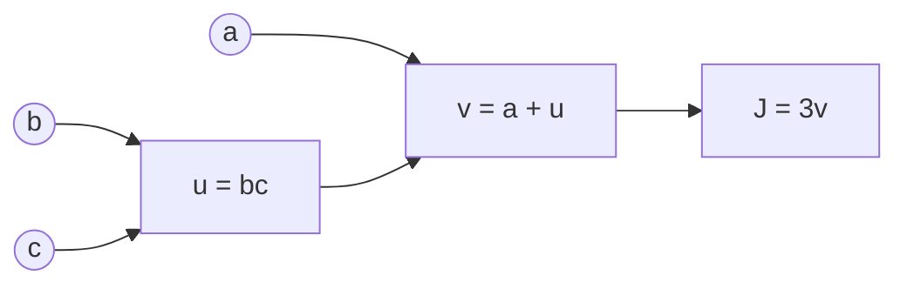

## Example
$$
\begin{align}
& J(a, b, c) = 3(a + bc) \\
& u = bc \\
& v = a + u
\end{align}
$$

```mermaid
flowchart LR
a((a)) --> v[v = a + u]
b((b)) --> u[u = bc]
c((c)) --> u
u --> v
v --> j[J = 3v]
```

