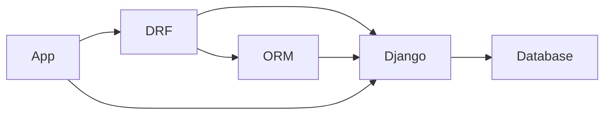

---
tags:
  - CS/Programming/Python/Django
---

## Django REST Framework

__Django REST Framework__ is a [[Django]] utility app [[Python]] library that bridges your regular Django app, the Django [[Framework]], and the object-relational mapper [[ORM]] which communicates with the database. It comes with many helpful utility classes and objects that can help developers build robust APIs quickly.

Helps to:
- Create RESTful APIs
- Serialize database models
- Convert, validate and render data

## Benefits
- ### 👍 Web browsable API
	- Django comes with an [[API]] viewer that allows you to send different [[HTTP methods]] with data and evaluate the output without needing external application link [[Insomnia]] .
- ### 👍 Request and response processing
	- DRF comes with its own request and response objects, which are wrappers of the regular Django HTTP response and HTTP request objects, but offers more flexibility on processing data in and out.
- ### 👍 Readable HTTP status codes
	- [[HTTP status codes]]
	- DRF uses `Status.HTTP_200_OK` or `Status.HTTP_404_NOT` instead of just `200` or `404`.
- ### 👍 Serialization
	- They are essential for converting objects and Django models into a more readable format like [[JSON]] or [[XML]].
	- Serializers also support converting other non-ORM objects.
- ### 👍 Deserialization
	- Used to convert user supplied data into models to store them safely in the database.
- ### 👍 CRUD helpers
	- DRF's built-in view set classes, make it quick and easy to create a functional [[CRUD]].

## Routers
Auto configure URLs from class-based views.

> [!Benefits of class based views: ]
> 
> - Less code 
> - Less duplication 
> - Extend classes 
> - Add features

## Filtering

## Pagination

## Caching

## Data sanitization
Eliminates vulnerabilities like SQL injection, XSS, CSRF, etc.

## Security
Data security is crucial because they give 3rd party clients access to your data.

- ### Authentication
Authentication is the process of verifying the identity of a user or client.
- ### Authorization
Authorization is the process of verifying that the user has access to the requested resource.

## Access control
All about setting roles and privileges for users to make sure only the right users have access to data.

## API throttling
Using the two throttling classes in DRF, you can control how often APIs can be accessed in a certain amount of time to prevent abuse.

## Related Documents
- [[Using Serializers in DRF (Example)]]
- [[Related Serializers in DRF]]
- [[Renderers in DRF]]

## Additional Resources

