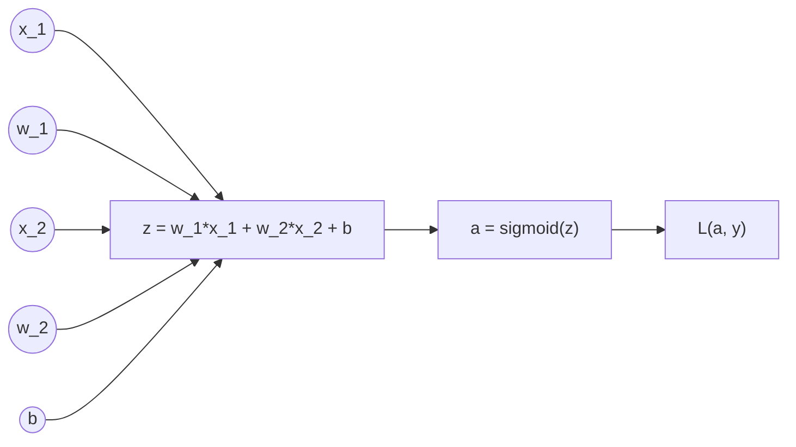

---
tags:
  - AI/Logistic_Regression
---


[[Gradient descent]] for [[Logistic regression]]

For all $j$. We can work out the derivative part using calculus to get:

Repeat {
	$\theta := \theta_j - \dfrac{\alpha}{m}\sum_{i=1}^m(h(x^{(i)}, \theta) - y^{(i)} ) x_j^{(i)}$
}

A vectorized implementation is:

$\theta := \theta - \dfrac{\alpha}{m}X^T(H(X, \theta) - Y)$


# Math derivation
## Partial derivative of $J(\theta)$
First calculate derivative of sigmoid function: [[Sigmoid#Derivative]] 

Note that we computed the partial derivative of the sigmoid function. If we were to derive $h(x^{(i)}, \theta)$ with respect to $\theta_j$, you would get 
$$\dfrac{\delta}{\delta\theta_j}h(x^{(i)}, \theta) = h(x^{(i)}, \theta)(1-h(x^{(i)}, \theta))x^{(i)}_j$$
Note that we used the chain rule there, because we multiplied by the derivative of $\theta^Tx^{(i)}$ with respect to $\theta_j$. Now we are ready to find out resulting partial derivative:
[[Logistic regression#Partial derivative]]


# Simple [[Computation graph]]
## For single example


$\frac{\delta L(a, y)}{\delta a} = -\frac{y}{a} + \frac{{1-y}}{1-a}$

$\frac{\delta L(a, y)}{\delta z} = a - y = \frac{\delta L(a, y)}{\delta a}  \frac{\delta a}{\delta z} = \left( -\frac{y}{a} + \frac{{1-y}}{1-a} \right) a(1-a) = a - y$
$\frac{{\delta L(a, y)}}{\delta w_{1}} = \frac{{\delta z}}{\delta w_{1}} \frac{\delta L(a, y)}{\delta z} = x_{1}(a-y)$
$\frac{{\delta L(a, y)}}{\delta w_{2}} = \frac{{\delta z}}{\delta w_{2}} \frac{\delta L(a, y)}{\delta z} = x_{2}(a-y)$
$\frac{{\delta L(a, y)}}{\delta b} = \frac{{\delta z}}{\delta b}\frac{\delta L(a, y)}{\delta z} = (a-y)$

## For $m$ examples
$$
\begin{align}
& J(w, b) = \frac{1}{m}\sum^{m}_{i=1} L(a^{(i)}, y^{(i)})  \\
& a^{(i)} = \hat{y}^{(i)} = \sigma(z^{(i)}) = \sigma(\vec{w}^T \vec{x}^{(i)} + b)
\end{align}
$$

### Pseudocode
__Define variables__
$J = 0; dw_{1} = 0; dw_{2} = 0; db = 0$

__Add total loss__
For $i = 1$ to $m$ {
	$z^{(i)} = \vec{w}^{T}\vec{x} + b$
	$a^{(i)} = \sigma(z^{(i)})$
	$J:= J -\left[y^{(i)} \log a^{(i)} + (1 - y^{(i)})(1 - \log a^{(i)})\right]$
	$dz^{(i)} = a^{(i)} - y^{(i)}$
	$dw_{1} := dw_{1} + x^{(i)}_{1}dz^{(i)}$
	$dw_{2} := dw_{2} + x^{(i)}_{2}dz^{(i)}$
	$db := db + dz^{(i)}$
} 

__Get mean of loss__
$J:= J / m$
$dw_{1}:= dw_{1} / m$
$dw_{2}:= dw_{2} / m$
$db:= db / m$

__Training__
$w_{1}:=w_{1} - \alpha dw_{1}$
$w_{2}:=w_{2} - \alpha dw_{2}$
$b:=b - \alpha db$

### Vectorized python
Single iteration
```python
# X.shape = (n_x, m)
# w.shape = (n_x, 1)
# y.shape = (1, m)

# Predict
z = np.dot(w.T, X) + b # shape = (1, m)
a = sigmoid(z) # shape = (1, m)

# Calculate gradient
dz = a - y
dw = 1/m * np.dot(X, dz.T) # shape = (n_x, 1)
db = 1/m * np.sum(dz)

# Train
w -= alpha * dw
b -= alpha * db
```

